# 基于Springboot的旅游网站

## Springboot-0013


## 技术栈

Springboot mybatisplus vue mysql maven


## 数据库表(15张)


## 功能介绍

```properties
1.用户管理：注册、登录、退出、修改密码；
2.分类显示：显示旅游路线的分类；
3.旅游路线显示：按分类查询旅游路线、通过关键字搜索旅游路线、查看旅游路线的详细信息；
4.购物车管理：向购物车中添加旅游路线、修改购物车中旅游路线数量、删除购物车中旅游路线、我的购物车；
5.订单管理：通过购物车中生成订单、查看我的订单、查看某个订单的详细、订单支付、取消未付款订单。
6.首页：提供一个网站首页，该网站用户的登录，注册，所有旅游路线的一级分类，热门旅游路线和最新旅游路线的展示等。
7.旅游路线管理：旅游路线的上架、下架。
```


## 图片

### 前台


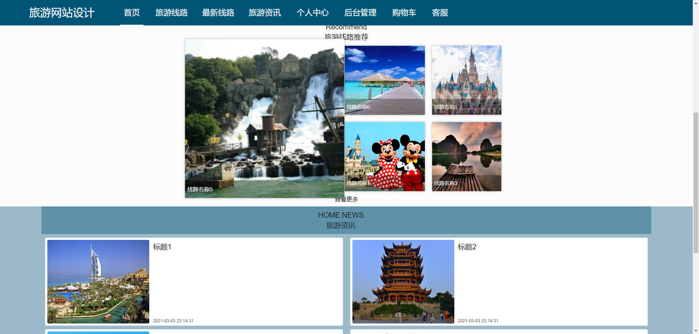


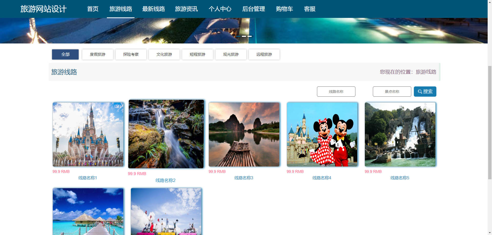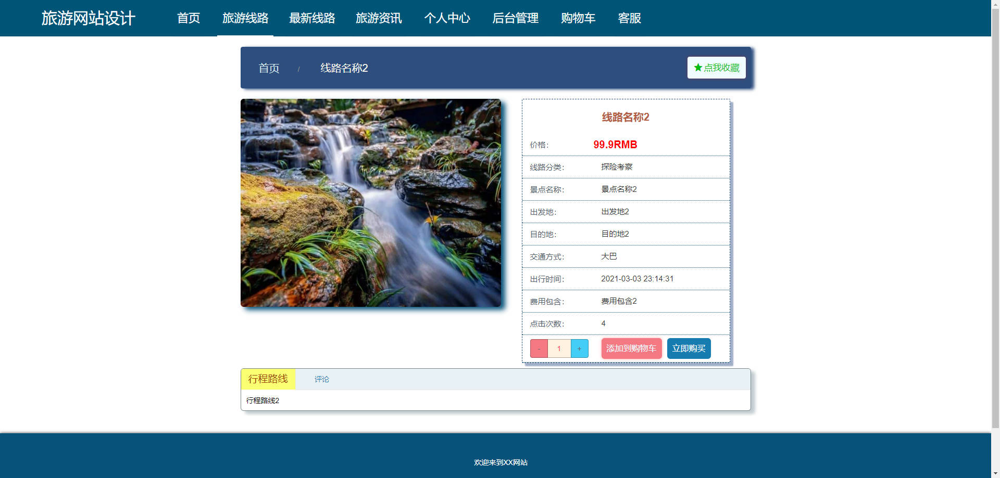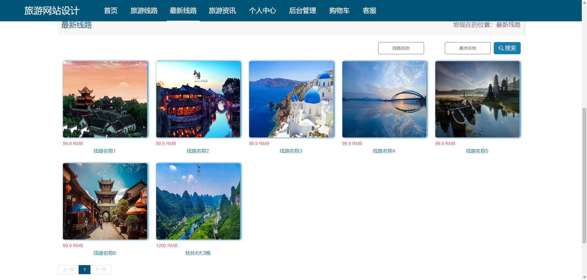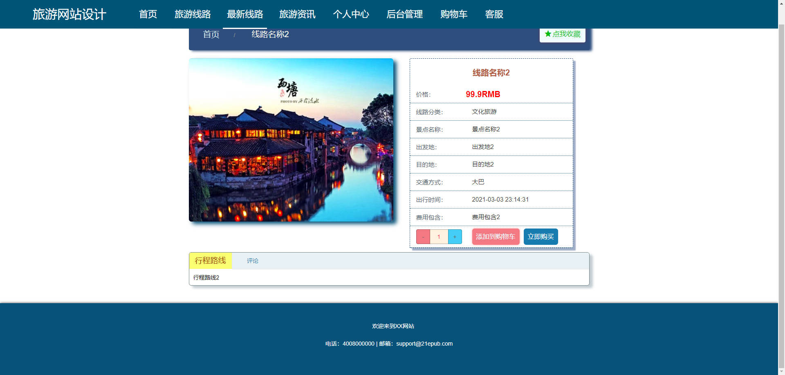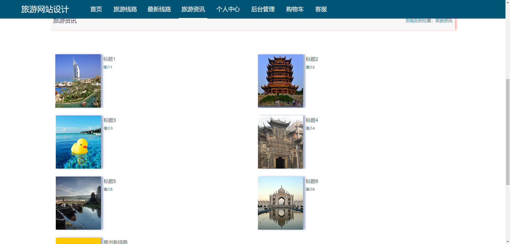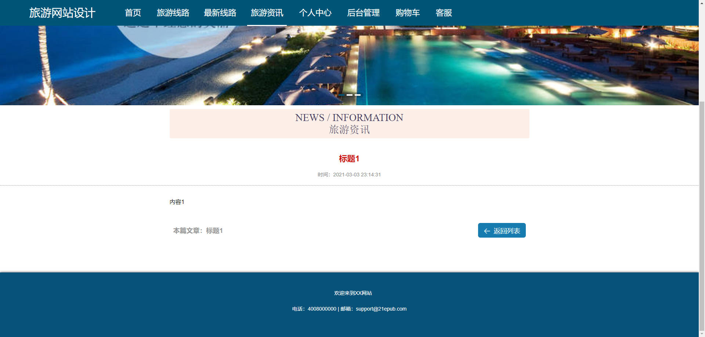

### 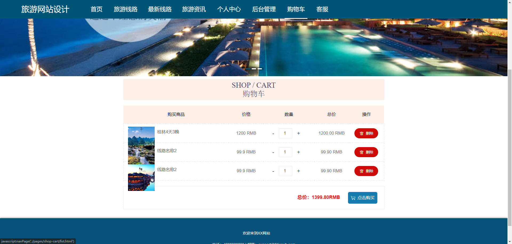后台

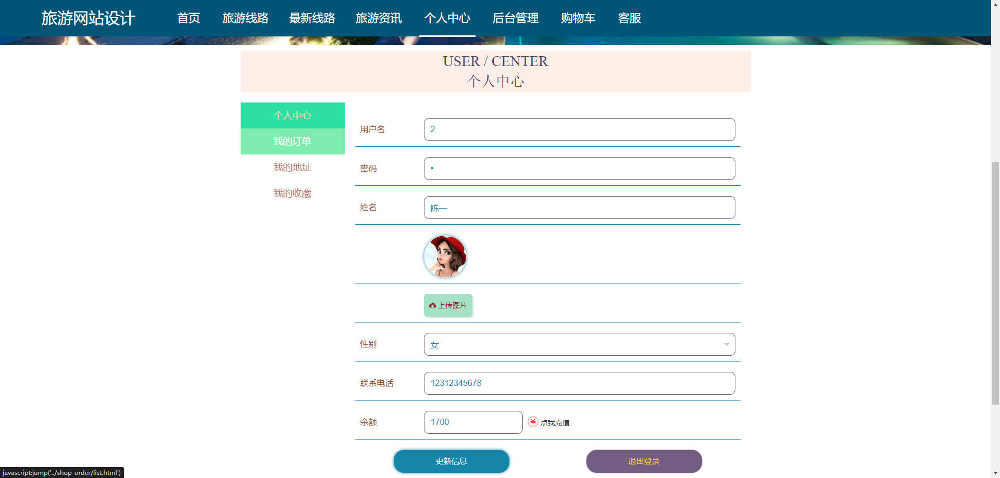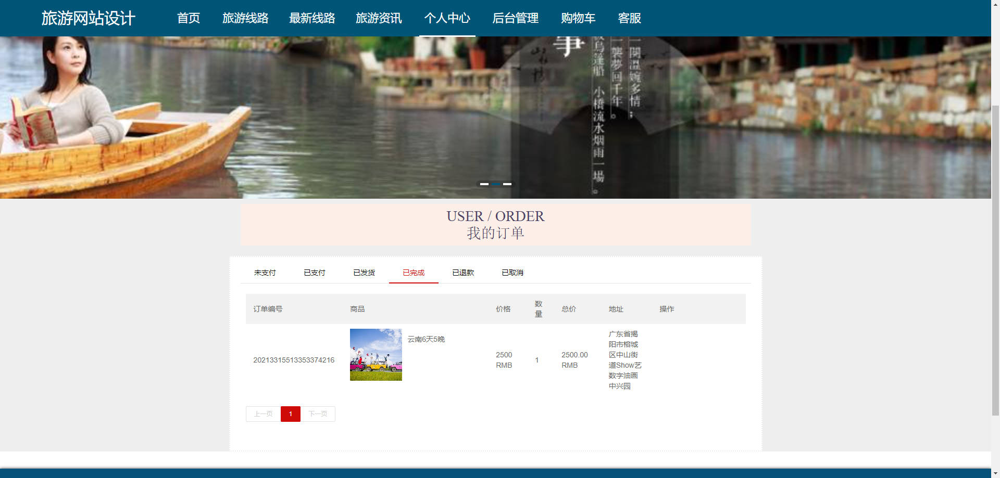

### 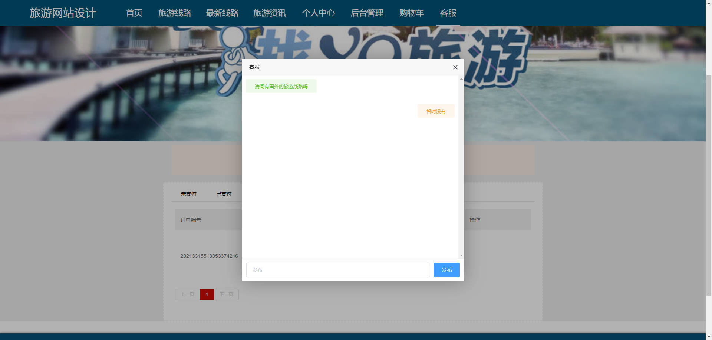后台


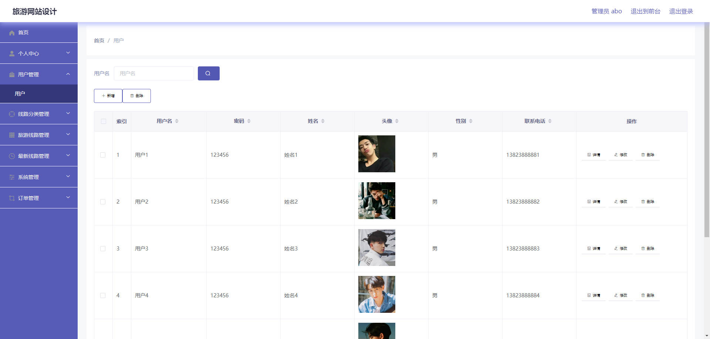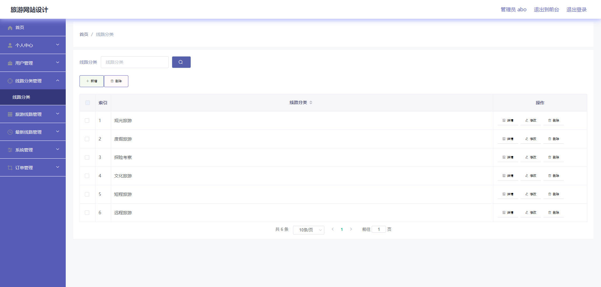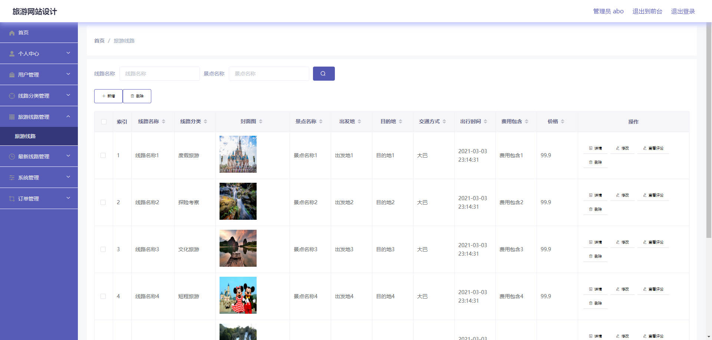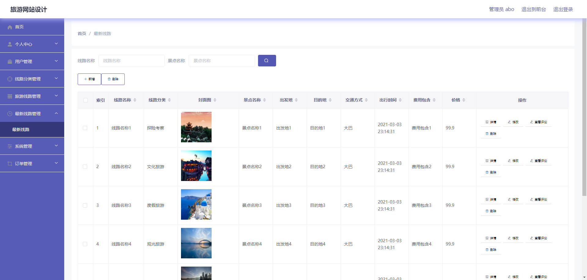

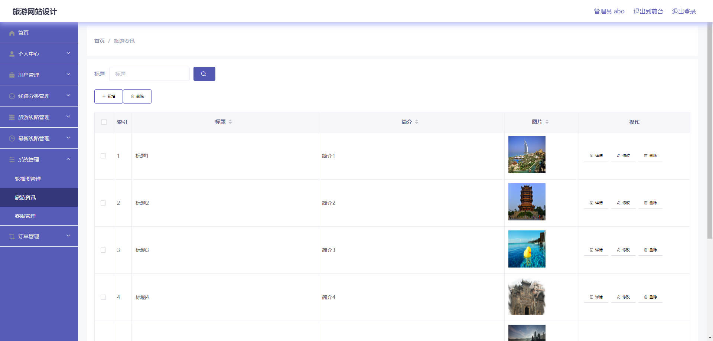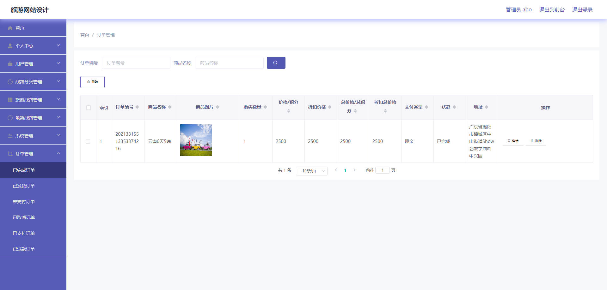

## 访问路径

### 前台

```properties
http://localhost:8080/springbootmt74k/front/pages/login/login.html

账号 2
密码 2
```

### 后台

```properties
http://localhost:8080/springbootmt74k/admin/dist/index.html#/login

账号 abo
密码 abo
```


## 功能图

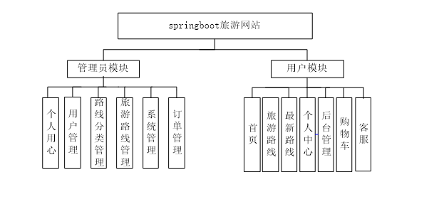


## 文档目录

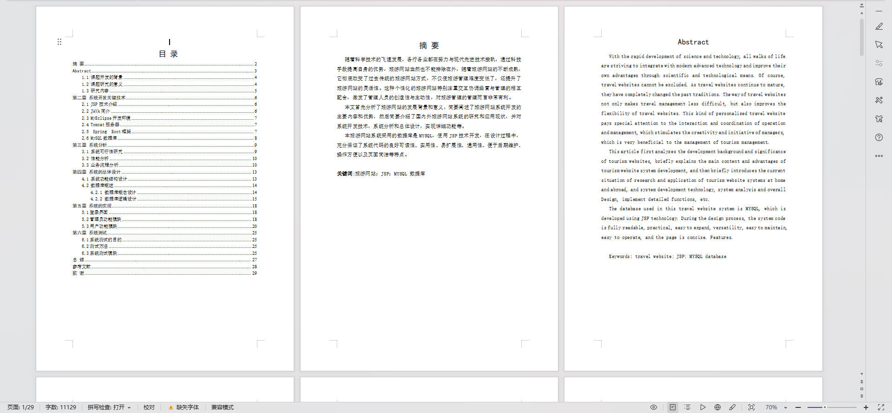


## 打赏或交流


